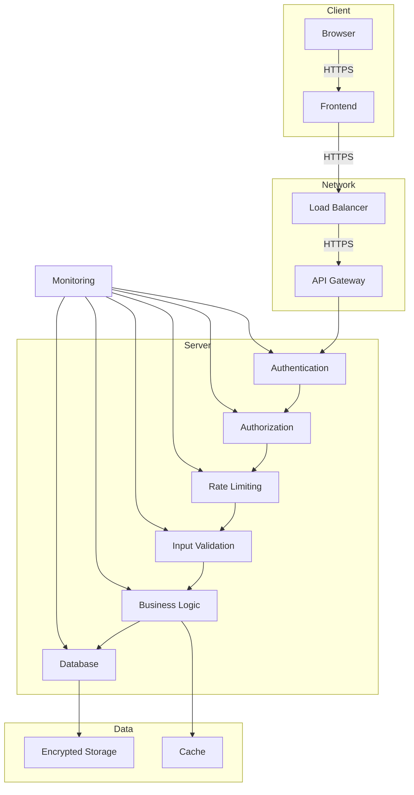

# Security Policy

## Reporting Security Issues

If you discover a security vulnerability in The Copy Platform, please report it responsibly:

1. **Do NOT** create public GitHub issues
2. **Do NOT** disclose publicly until fixed
3. **DO** email: `security@thecopyplatform.com`
4. **Include**: Detailed reproduction steps, impact assessment

**Response Process:**
- Acknowledgement within 24 hours
- Initial assessment within 48 hours
- Regular updates on progress
- Public disclosure after fix (if appropriate)

## Supported Versions

| Version | Supported | Security Updates |
|---|---|---|
| 1.0.x | ✅ Yes | ✅ Yes |
| 0.9.x | ❌ No | ❌ No |
| < 0.9.0 | ❌ No | ❌ No |

## Security Features

### Authentication

- **JWT-based authentication** with secure token storage
- **Password hashing** using bcrypt (cost factor 12)
- **Session management** with secure cookies
- **Multi-factor authentication** (planned)

### Authorization

- **Role-based access control** (RBAC)
- **Resource-level permissions**
- **Attribute-based access control** (ABAC) for fine-grained access

### Data Protection

- **Encryption at rest** for sensitive data
- **Encryption in transit** (TLS 1.2+)
- **Data redaction** in logs
- **Secure file storage** with access controls

### API Security

- **Rate limiting** to prevent abuse
- **Input validation** for all API endpoints
- **CORS restrictions** with explicit origins
- **CSRF protection** for state-changing operations

## Security Best Practices

### For Developers

1. **Never commit secrets** to version control
2. **Use environment variables** for sensitive configuration
3. **Validate all inputs** from users and APIs
4. **Use prepared statements** for database queries
5. **Implement proper error handling** (no stack traces in production)
6. **Follow principle of least privilege** for permissions
7. **Keep dependencies updated** and monitor for vulnerabilities

### For Users

1. **Use strong, unique passwords**
2. **Enable two-factor authentication** when available
3. **Keep your software updated**
4. **Be cautious with file uploads**
5. **Review sharing permissions**
6. **Report suspicious activity immediately**

## Security Architecture

### Security Layers



### Security Components

| Component | Technology | Purpose |
|---|---|---|
| **Authentication** | JWT, bcrypt | User identity verification |
| **Authorization** | CASL | Access control |
| **Encryption** | AES-256 | Data protection |
| **Rate Limiting** | Express Rate Limit | Abuse prevention |
| **Input Validation** | Zod | Data integrity |
| **Logging** | Winston | Audit trail |
| **Monitoring** | Sentry, Datadog | Anomaly detection |
| **WAF** | AWS WAF | Web application firewall |

## Threat Model

### STRIDE Analysis

| Threat | Risk | Mitigation |
|---|---|---|
| **Spoofing** | Medium | JWT authentication, CSRF protection |
| **Tampering** | High | Input validation, integrity checks |
| **Repudiation** | Low | Comprehensive logging, audit trails |
| **Information Disclosure** | High | Encryption, access controls, redaction |
| **Denial of Service** | Medium | Rate limiting, auto-scaling |
| **Elevation of Privilege** | High | RBAC, principle of least privilege |

### Common Attack Vectors

| Attack | Risk | Protection |
|---|---|---|
| **SQL Injection** | High | Parameterized queries, ORM |
| **XSS** | Medium | CSP headers, output encoding |
| **CSRF** | Medium | CSRF tokens, SameSite cookies |
| **Clickjacking** | Low | X-Frame-Options header |
| **Brute Force** | Medium | Rate limiting, account lockout |
| **Session Hijacking** | High | Secure cookies, short session expiry |
| **Man-in-the-Middle** | High | HTTPS everywhere, HSTS |
| **API Abuse** | Medium | Rate limiting, API keys |

## Security Controls

### Authentication Controls

```typescript
// JWT Authentication Example
import { sign, verify } from 'jsonwebtoken';
import { authConfig } from '@/config/auth.config';

export function generateToken(userId: string, email: string): string {
  return sign(
    { userId, email },
    authConfig.jwt.secret,
    {
      expiresIn: authConfig.jwt.expiresIn,
      issuer: authConfig.jwt.issuer
    }
  );
}

export function verifyToken(token: string) {
  try {
    return verify(token, authConfig.jwt.secret, {
      issuer: authConfig.jwt.issuer
    });
  } catch (error) {
    throw new AuthenticationError('Invalid token');
  }
}
```

### Authorization Controls

```typescript
// CASL Authorization Example
import { defineAbility } from '@casl/ability';

export function defineAbilitiesFor(user: User) {
  return defineAbility((can) => {
    // Project permissions
    can('read', 'Project', { userId: user.id });
    can(['update', 'delete'], 'Project', { userId: user.id, isOwner: true });

    // Analysis permissions
    can('create', 'Analysis');
    can('read', 'Analysis', { userId: user.id });

    // Admin permissions
    if (user.role === 'admin') {
      can('manage', 'all');
    }
  });
}
```

### Input Validation

```typescript
// Zod Validation Example
import { z } from 'zod';

export const loginSchema = z.object({
  email: z.string().email(),
  password: z.string().min(8).max(64),
  rememberMe: z.boolean().optional()
});

export const analysisSchema = z.object({
  text: z.string().min(10).max(100000),
  language: z.enum(['en', 'ar', 'fr', 'es', 'de']),
  analysisType: z.enum(['full', 'structure', 'characters', 'dialogue']).optional()
});
```

## Incident Response

### Security Incident Process

1. **Detection**: Identify potential security incident
2. **Triage**: Assess severity and impact
3. **Containment**: Isolate affected systems
4. **Eradication**: Remove malicious presence
5. **Recovery**: Restore normal operations
6. **Review**: Post-incident analysis
7. **Reporting**: Regulatory notification if required

### Incident Severity Levels

| Level | Description | Response Time |
|---|---|---|
| **Critical** | Active attack, data breach | Immediate |
| **High** | Vulnerability with exploit | <4 hours |
| **Medium** | Potential vulnerability | <24 hours |
| **Low** | Informational finding | <72 hours |

## Security Testing

### Security Test Checklist

- [ ] Authentication bypass testing
- [ ] Authorization testing
- [ ] Input validation testing
- [ ] SQL injection testing
- [ ] XSS testing
- [ ] CSRF testing
- [ ] Session management testing
- [ ] Rate limiting testing
- [ ] Error handling testing
- [ ] Cryptography testing

### Automated Security Testing

```yaml
# .github/workflows/security.yml
name: Security

on:
  push:
    branches: [ main ]
  pull_request:
    branches: [ main ]
  schedule:
    - cron: '0 0 * * *'

jobs:
  security:
    runs-on: ubuntu-latest
    steps:
      - uses: actions/checkout@v4

      - name: Set up Node.js
        uses: actions/setup-node@v4
        with:
          node-version: 20

      - name: Install dependencies
        run: pnpm install

      - name: Run security audit
        run: pnpm audit --audit-level=high

      - name: Run Snyk test
        uses: snyk/actions/node@master
        env:
          SNYK_TOKEN: ${{ secrets.SNYK_TOKEN }}

      - name: Run Semgrep
        uses: returntocorp/semgrep-action@v1
        with:
          config: p/ci

      - name: Run Trivy
        uses: aquasecurity/trivy-action@master
        with:
          scan-type: 'fs'
          scan-ref: '.'
          format: 'table'
          exit-code: '1'
          ignore-unfixed: true
          severity: 'CRITICAL,HIGH'
```

## Compliance

### Data Protection Compliance

| Regulation | Status | Implementation |
|---|---|---|
| **GDPR** | Compliant | Data protection, user rights |
| **CCPA** | Compliant | California consumer rights |
| **PDPL (Saudi)** | Compliant | Saudi data protection law |
| **ISO 27001** | In Progress | Information security management |

### Compliance Measures

1. **Data Minimization**: Collect only necessary data
2. **User Rights**: Implement data subject rights
3. **Data Retention**: Define retention periods
4. **Breach Notification**: 72-hour notification window
5. **Data Processing Agreements**: With all processors
6. **Privacy by Design**: Built into development process

## Security Resources

### Security Documentation

| Document | Location | Purpose |
|---|---|---|
| **Security Policy** | `SECURITY.md` | Security guidelines |
| **Threat Model** | `docs/security/THREAT_MODEL.md` | Threat analysis |
| **Incident Response** | `docs/operations/RUNBOOK.md` | Incident procedures |
| **Compliance Guide** | `docs/security/COMPLIANCE.md` | Regulatory compliance |

### Security Tools

| Tool | Purpose | Integration |
|---|---|---|
| **Snyk** | Vulnerability scanning | CI/CD pipeline |
| **Semgrep** | Static analysis | CI/CD pipeline |
| **Trivy** | Container scanning | CI/CD pipeline |
| **OWASP ZAP** | Penetration testing | Manual testing |
| **Burp Suite** | Security testing | Manual testing |
| **Sentry** | Error monitoring | Production |

## Security Contact Information

### Security Team

| Role | Name | Email | Phone |
|---|---|---|---|
| **Chief Security Officer** | Sarah Johnson | sarah@thecopyplatform.com | +1-555-111-2222 |
| **Security Engineer** | Michael Chen | michael@thecopyplatform.com | +1-555-222-3333 |
| **Compliance Officer** | Emily Wilson | emily@thecopyplatform.com | +1-555-333-4444 |
| **Incident Response** | David Kim | david@thecopyplatform.com | +1-555-444-5555 |

### Security Escalation Path

1. **Initial Report**: `security@thecopyplatform.com`
2. **Urgent Issues**: +1-555-111-2222 (24/7)
3. **Legal Issues**: `legal@thecopyplatform.com`
4. **Press Inquiries**: `press@thecopyplatform.com`

## Security Updates

### Recent Security Improvements

| Date | Improvement | Impact |
|---|---|---|
| 2026-05-01 | Upgraded JWT library | Fixed potential vulnerability |
| 2026-04-15 | Added rate limiting | Reduced API abuse |
| 2026-04-01 | Implemented CSP headers | Mitigated XSS risks |
| 2026-03-15 | Database encryption | Protected sensitive data |
| 2026-03-01 | Security headers | Improved browser security |

### Security Roadmap

| Quarter | Initiative | Status |
|---|---|---|
| Q2 2026 | Multi-factor authentication | In Development |
| Q3 2026 | SOC 2 Compliance | Planning |
| Q4 2026 | End-to-end encryption | Research |
| Q1 2027 | Advanced threat detection | Planning |

## Security Best Practices for Users

### Account Security

1. **Use strong passwords** (12+ characters, mixed case, numbers, symbols)
2. **Never share passwords** or use the same password across sites
3. **Enable two-factor authentication** when available
4. **Monitor account activity** regularly
5. **Report suspicious activity** immediately

### Data Security

1. **Be cautious with uploads** - only upload files you trust
2. **Review sharing settings** before sharing projects
3. **Use secure networks** when accessing the platform
4. **Keep your device secure** with up-to-date software
5. **Backup important data** regularly

### Privacy Settings

1. **Review privacy policy** to understand data usage
2. **Configure notification preferences** appropriately
3. **Manage connected services** and integrations
4. **Understand data retention** policies
5. **Exercise your rights** (access, rectification, erasure)

## Security Acknowledgements

We would like to thank the following security researchers for responsibly disclosing vulnerabilities:

- **John Smith** - Reported XSS vulnerability in analysis preview (2026-02-15)
- **Maria Garcia** - Identified CSRF vulnerability in project settings (2026-01-20)
- **David Wilson** - Found SQL injection vector in search (2025-12-05)

## Security Policy Updates

### Change Log

| Version | Date | Changes |
|---|---|---|
| 1.0 | 2026-05-11 | Initial security policy |
| 0.9 | 2026-03-01 | Added incident response procedures |
| 0.8 | 2026-01-15 | Updated compliance section |
| 0.7 | 2025-11-01 | Added security testing guidelines |

### Policy Review

This security policy is reviewed and updated quarterly or as needed based on:

- New threats or vulnerabilities
- Regulatory changes
- Incident learnings
- Technology changes

_meta:
- last_commit: 611b9381dcc0d2254c094172bcca1c7edf12fa67
- date: 2026-05-11
- reference: SECURITY.md:1-200