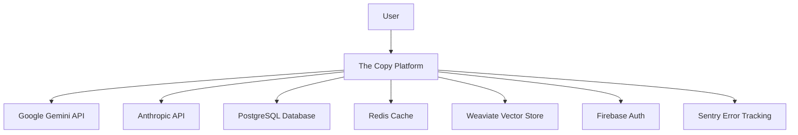
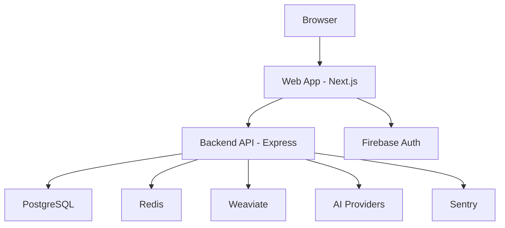
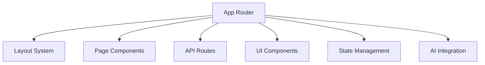
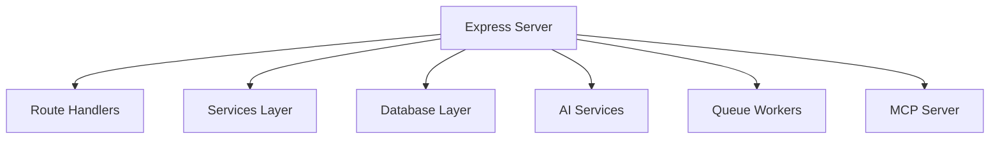
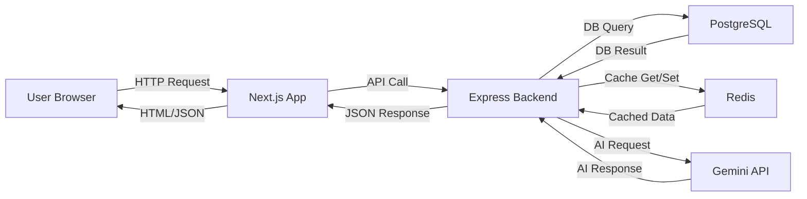
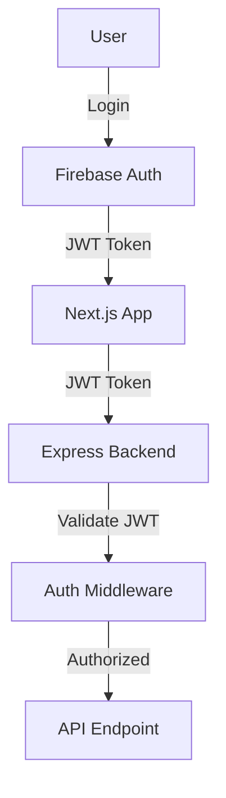
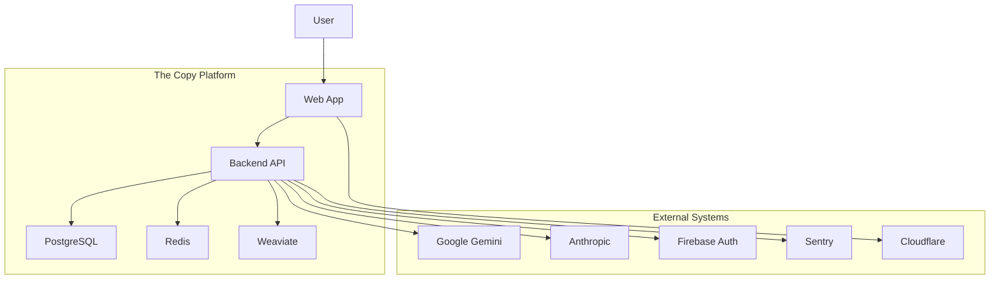
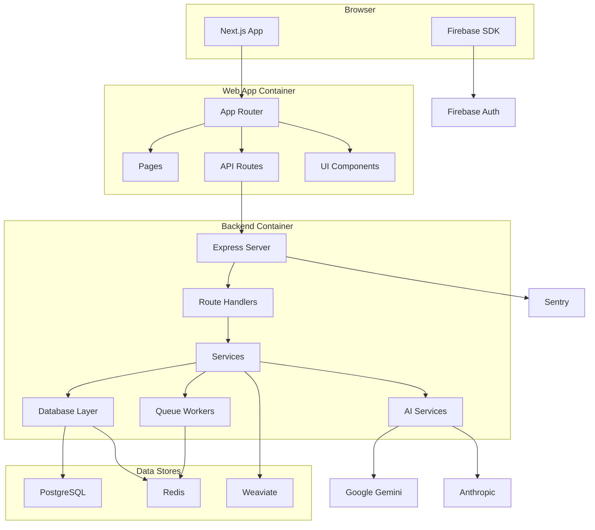

# توثيق المعمارية — The Copy Platform

آخر تحديث: 2026-05-11
مرجع الكود: `apps/web/src/app/page.tsx`, `apps/backend/src/server.ts`

## ملخص

يحتوي هذا المستند على المعمارية الشاملة لمنصة The Copy باستخدام نماذج C4، بما في ذلك سياق النظام، الحاويات، المكونات، تدفق البيانات، والمكدس التكنولوجي.

## 1. سياق النظام (C4 Level 1)

### فاعلون خارجيون

| الفاعل | الوصف | البروتوكول |
|---|---|---|
| المستخدم | مستخدم نهائي للمنصة | HTTPS, WebSocket |
| Google Gemini | مزود الذكاء الاصطناعي الأساسي | HTTPS REST API |
| Anthropic | مزود نماذج اللغة الكبيرة | HTTPS REST API |
| PostgreSQL | قاعدة البيانات الأساسية | PostgreSQL Protocol |
| Redis | تخزين مؤقت وطوابير | Redis Protocol |
| Weaviate | بحث متجهي | HTTP/JSON |
| Firebase Auth | مصادقة المستخدم | Firebase Auth API |
| Sentry | تتبع الأخطاء | Sentry Protocol |

## 2. حاويات النظام (C4 Level 2)

### حاويات النظام

| الحاوية | التقنية | المنفذ | الوصف |
|---|---|---|---|
| Web App | Next.js 16.1.5 | 5000 | تطبيق الواجهة مع App Router |
| Backend API | Express.js 5.1.0 | 3001 | خادوم API مع منطق الأعمال |
| PostgreSQL | PostgreSQL 16.x | 5432 | قاعدة البيانات الأساسية |
| Redis | Redis 7.x | 6379 | تخزين مؤقت وطوابير |
| Weaviate | Weaviate 1.25.x | 8080 | بحث متجهي |
| Firebase Auth | Firebase | - | مصادقة المستخدم |

## 3. مكونات الحاويات (C4 Level 3)

### مكونات تطبيق الويب

| المكون | التقنية | الوصف |
|---|---|---|
| App Router | Next.js App Router | نظام التوجيه الرئيسي |
| Layout System | React Server Components | نظام layouts المشترك |
| Page Components | React 19.2.1 | مكونات الصفحات الرئيسية |
| API Routes | Next.js Route Handlers | واجهات برمجية محلية |
| UI Components | @the-copy/ui | مكتبة المكونات المشتركة |
| State Management | Zustand + TanStack Query | إدارة الحالة |
| AI Integration | Vercel AI SDK | تكاملات الذكاء الاصطناعي |

### مكونات خادوم الخلفية

| المكون | التقنية | الوصف |
|---|---|---|
| Express Server | Express.js | خادوم HTTP الرئيسي |
| Route Handlers | Express Router | معالجات المسارات |
| Services Layer | Custom Services | منطق الأعمال |
| Database Layer | Drizzle ORM | الوصول إلى قاعدة البيانات |
| AI Services | Google Genkit | خدمات الذكاء الاصطناعي |
| Queue Workers | BullMQ | معالجة الطوابير |
| MCP Server | @modelcontextprotocol/sdk | بروتوكول السياق |

## 4. تدفق البيانات الرئيسي

### سيناريوهات تدفق البيانات

1. **تحميل الصفحة الرئيسية**:
   - المتصفح → Next.js → عرض HTML

2. **طلب API**:
   - المتصفح → Next.js → Express → معالجة → استجابة JSON

3. **معالجة PDF**:
   - المتصفح → Next.js → Express → AI Services → استجابة

4. **مصادقة المستخدم**:
   - المتصفح → Firebase Auth → JWT → Express → بيانات المستخدم

## 5. المكدس التكنولوجي

### طبقة الواجهة

| الطبقة | التقنية | الإصدار | الغرض |
|---|---|---|---|
| Framework | Next.js | 16.1.5 | إطار عمل React |
| Language | TypeScript | 5.x | لغة البرمجة |
| UI Library | React | 19.2.1 | مكتبة الواجهة |
| State Management | Zustand | 5.0.x | إدارة الحالة |
| Data Fetching | TanStack Query | 5.90.x | استعلام البيانات |
| Editor | Tiptap | 3.0.x | محرر النصوص |
| 3D Graphics | Three.js | 9.5.x | رسوميات ثلاثية الأبعاد |
| Styling | CSS Modules | - | أنماط المكونات |

### طبقة الخلفية

| الطبقة | التقنية | الإصدار | الغرض |
|---|---|---|---|
| Framework | Express.js | 5.1.0 | إطار عمل Node.js |
| Language | TypeScript | 5.x | لغة البرمجة |
| ORM | Drizzle | 0.44.x | الوصول إلى قاعدة البيانات |
| Queues | BullMQ | 5.x | معالجة الطوابير |
| Realtime | Socket.io | 4.8.x | الاتصال الآني |
| AI SDK | Google Genkit | 1.30.x | خدمات الذكاء الاصطناعي |
| MCP | @modelcontextprotocol/sdk | 1.26.x | بروتوكول السياق |

### قاعدة البيانات

| المكون | التقنية | الإصدار | الغرض |
|---|---|---|---|
| Primary DB | PostgreSQL | 16.x | قاعدة البيانات الأساسية |
| Secondary DB | MongoDB | 7.0.x | تخزين المستندات |
| Cache | Redis | 7.x | تخزين مؤقت |
| Vector Store | Weaviate | 1.25.x | بحث متجهي |
| Search | - | - | بحث نصي |

### البنية التحتية

| المكون | التقنية | الغرض |
|---|---|---|
| Containerization | Docker | حاويات التطبيقات |
| Orchestration | Kubernetes | إدارة الحاويات |
| CI/CD | GitHub Actions | تكامل مستمر/نشر مستمر |
| Monitoring | Prometheus + Grafana | مراقبة النظام |
| Tracing | OpenTelemetry | تتبع الطلبات |
| Logging | ELK Stack | تسجيل السجلات |
| Error Tracking | Sentry | تتبع الأخطاء |

## 6. الاعتبارات المتقاطعة

### المصادقة والأذونات

### التخزين المؤقت

| المستوى | التقنية | استراتيجية | مهلة |
|---|---|---|---|
| متصفح | - | - | - |
| CDN | Cloudflare | Cache-Control | 5 دقائق |
| خادم | Redis | key-based | 15 دقيقة |
| قاعدة بيانات | - | - | - |

### الحد من المعدل

| المستوى | الحد | النافذة | الاستثناءات |
|---|---|---|---|
| API العام | 100 طلب/دقيقة | 15 دقيقة | - |
| مصادقة | 10 محاولات/دقيقة | 1 دقيقة | - |
| AI Endpoints | 20 طلب/دقيقة | 5 دقائق | المستخدمون المتميزون |

### الدولية

| الميزة | الحالة | الملاحظات |
|---|---|---|
| ترجمة الواجهة | غير مفعلة | مخطط لها |
| ترجمة المحتوى | غير مفعلة | مخطط لها |
| تنسيق التاريخ | العربية | مفعلة |
| اتجاه النص | RTL | مفعلة |

### الوصول

| الميزة | الحالة | المعيار |
|---|---|---|
| لوحات المفاتيح | مفعلة | WCAG 2.1 AA |
| قارئ الشاشة | مفعلة | ARIA Attributes |
| تباين الألوان | مفعلة | 4.5:1 Minimum |
| حجم الخط | قابل للتكبير | 200% Zoom |

## 7. قرارات المعمارية الرئيسية

### قرارات المكدس التكنولوجي

| القرار | البدائل | السبب |
|---|---|---|
| Next.js | Remix, SvelteKit | نظام بيئي ناضج، دعم RSC |
| Express.js | Fastify, NestJS | بساطة، أداء، مرونة |
| Drizzle ORM | Prisma, TypeORM | أداء، نوع آمن، خفيف |
| BullMQ | Agenda, Bee-Queue | أداء Redis، موثوقية |
| PostgreSQL | MySQL, SQL Server | ميزات متقدمة، أداء |

### قرارات البنية

| القرار | البدائل | السبب |
|---|---|---|
| Monorepo | Polyrepo | مشاركة الكود، اعتمادات موحدة |
| Turborepo | Nx, Lerna | أداء البناء، تخزين مؤقت |
| pnpm | npm, yarn | كفاءة، دعم monorepo |
| Kubernetes | Docker Swarm, Nomad | نظام بيئي ناضج، قابل للتوسع |

## 8. مقايضات المعمارية

### مقايضات الأداء

| القرار | الفائدة | التكلفة |
|---|---|---|
| React Server Components | أداء أفضل، SEO | تعقيد التطوير |
| Redis Caching | استجابة أسرع | تعقيد التخزين المؤقت |
| BullMQ Queues | معالجة غير متزامنة | تعقيد النظام |

### مقايضات التطوير

| القرار | الفائدة | التكلفة |
|---|---|---|
| TypeScript | نوع آمن، صيانة أفضل | منحنى تعليمي |
| Monorepo | مشاركة الكود، اعتمادات موحدة | تعقيد البناء |
| Drizzle ORM | نوع آمن، أداء | منحنى تعليمي |

## 9. مخططات C4 الكاملة

### مخطط سياق النظام الكامل

### مخطط حاويات النظام الكامل

## 10. المراجع

- `docs/ADR/` — سجلات قرارات المعمارية
- `apps/web/src/app/` — كود الواجهة
- `apps/backend/src/` — كود الخلفية
- `packages/*/` — حزم مشتركة