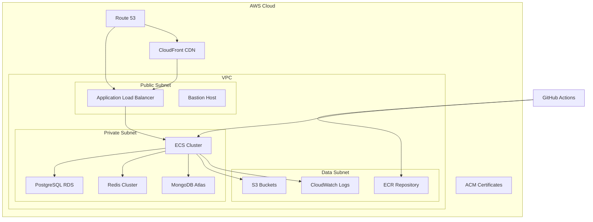
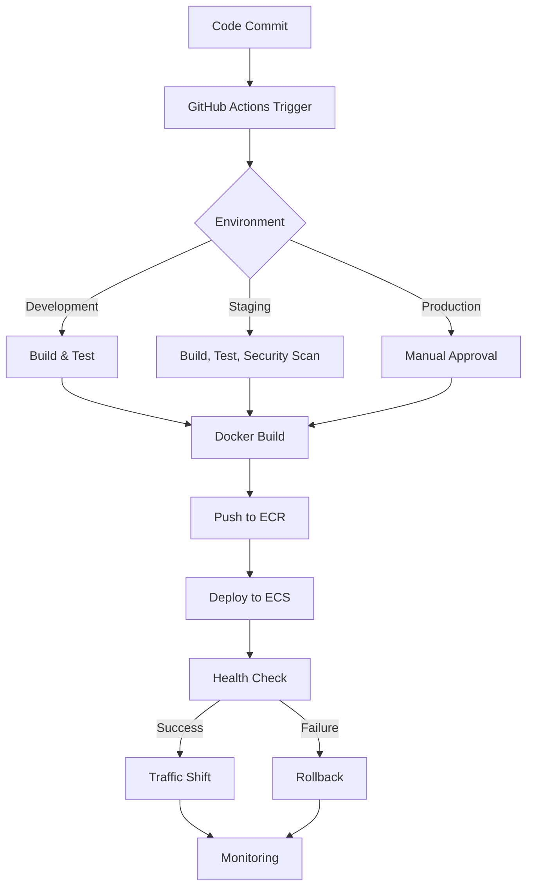

# Deployment Guide

## Environments

| Environment | URL | Purpose | Owner |
|---|---|---|---|
| Development | `http://localhost:3001` | Local development | Developers |
| Staging | `https://staging.thecopyplatform.com` | Pre-production testing | DevOps Team |
| Production | `https://api.thecopyplatform.com` | Live production | DevOps Team |

## Infrastructure Architecture



### Infrastructure Components

1. **Compute**: ECS Fargate with auto-scaling (2-10 instances)
2. **Database**: PostgreSQL RDS with Multi-AZ deployment
3. **Caching**: Elasticache Redis cluster (3 nodes)
4. **Storage**: S3 for file storage and assets
5. **CDN**: CloudFront for static asset delivery
6. **Monitoring**: CloudWatch for logs and metrics
7. **CI/CD**: GitHub Actions for deployment pipelines
8. **DNS**: Route 53 for domain management
9. **Security**: WAF, Security Groups, IAM roles

## Deployment Pipeline



### Pipeline Stages

1. **Build**: Docker image build with multi-stage optimization
2. **Test**: Unit tests, integration tests, security scans
3. **Security**: Container scanning, vulnerability checks
4. **Deploy**: Blue-green deployment to ECS
5. **Verify**: Health checks and smoke tests
6. **Monitor**: Post-deployment monitoring

## Deployment Procedures

### Manual Deployment (Emergency)

```bash
# Login to AWS ECR
aws ecr get-login-password | docker login --username AWS --password-stdin ACCOUNT_ID.dkr.ecr.REGION.amazonaws.com

# Build and tag Docker image
docker build -t thecopy-platform:1.0.0 -f apps/backend/Dockerfile .
docker tag thecopy-platform:1.0.0 ACCOUNT_ID.dkr.ecr.REGION.amazonaws.com/thecopy-platform:1.0.0

# Push to ECR
docker push ACCOUNT_ID.dkr.ecr.REGION.amazonaws.com/thecopy-platform:1.0.0

# Update ECS service
aws ecs update-service \
  --cluster thecopy-production \
  --service backend-service \
  --force-new-deployment \
  --region REGION
```

### Database Migrations

```bash
# Apply database migrations
pnpm --filter @the-copy/backend db:push

# Generate new migrations
pnpm --filter @the-copy/backend db:generate

# Open Drizzle Studio
pnpm --filter @the-copy/backend db:studio
```

### Zero-Downtime Deployment Strategy

1. **Blue-Green Deployment**: Maintain two identical environments
2. **Traffic Shifting**: Gradually shift traffic from blue to green
3. **Health Checks**: Comprehensive health checks before traffic shift
4. **Rollback**: Instant rollback capability
5. **Session Persistence**: Redis session persistence across deployments

## Feature Flags

### Feature Flag Management

| Flag | Description | Default | Environment |
|---|---|---|---|
| `NEW_ANALYSIS_ENGINE` | New analysis engine | false | All |
| `ENHANCED_CHARACTER_AI` | Enhanced character AI | true | Staging, Production |
| `REALTIME_COLLABORATION` | Real-time collaboration | false | Development |
| `ADVANCED_BUDGET_TOOL` | Advanced budgeting tools | true | Production |

### Feature Flag Usage

```typescript
// Check feature flag
const isEnabled = await featureFlags.isEnabled('NEW_ANALYSIS_ENGINE');

// Conditional feature execution
if (isEnabled) {
  // Use new analysis engine
} else {
  // Use legacy analysis engine
}
```

## Smoke Tests

### Post-Deployment Verification

```bash
# Run smoke tests
curl -X GET https://api.thecopyplatform.com/health
curl -X GET https://api.thecopyplatform.com/health/ready
curl -X GET https://api.thecopyplatform.com/health/live

# Check database connectivity
pnpm --filter @the-copy/backend test:mongodb

# Verify API endpoints
curl -X POST https://api.thecopyplatform.com/auth/login \
  -H "Content-Type: application/json" \
  -d '{"email":"test@example.com","password":"test123"}'
```

### Smoke Test Checklist

- [ ] Health endpoints respond with status 200
- [ ] Database connections are active
- [ ] Redis cache is operational
- [ ] Authentication endpoints work
- [ ] Critical API endpoints respond
- [ ] WebSocket connections can be established
- [ ] Background jobs can be queued
- [ ] Error rates are within acceptable limits

## Rollback Procedures

### Automatic Rollback Triggers

1. **Health Check Failures**: 3 consecutive failures
2. **Error Rate Threshold**: >5% error rate for 5 minutes
3. **Response Time Degradation**: >200% increase in response time
4. **Critical Service Failure**: Database or cache connectivity lost

### Manual Rollback Steps

```bash
# Rollback to previous version
aws ecs update-service \
  --cluster thecopy-production \
  --service backend-service \
  --force-new-deployment \
  --deployment-configuration "deploymentMinimumHealthyPercent=0,deploymentMaximumPercent=200" \
  --region REGION

# Monitor rollback
aws ecs describe-services \
  --cluster thecopy-production \
  --services backend-service \
  --region REGION
```

### Rollback Decision Matrix

| Issue Type | Severity | Rollback Timeframe | Notification |
|---|---|---|---|
| Critical Service Failure | High | Immediate | All stakeholders |
| Major Functionality Break | High | <15 minutes | DevOps + Developers |
| Performance Degradation | Medium | <30 minutes | DevOps Team |
| Minor Bugs | Low | Next deployment | Development Team |

## Database Management

### Backup Strategy

| Type | Frequency | Retention | Storage |
|---|---|---|---|
| Full Backup | Daily | 30 days | S3 |
| Incremental Backup | Hourly | 7 days | S3 |
| Transaction Logs | Continuous | 30 days | S3 |

### Restore Procedures

```bash
# Restore from backup
aws rds restore-db-instance-from-db-snapshot \
  --db-instance-identifier thecopy-db-restored \
  --db-snapshot-identifier thecopy-db-snapshot-2026-05-10 \
  --region REGION

# Monitor restore progress
aws rds describe-db-instances \
  --db-instance-identifier thecopy-db-restored \
  --region REGION
```

## Monitoring and Observability

### Key Metrics

| Metric | Threshold | Alert Severity |
|---|---|---|
| CPU Utilization | >80% for 5m | Warning |
| Memory Utilization | >90% for 5m | Critical |
| Response Time | >500ms | Warning |
| Error Rate | >2% | Critical |
| Database Connections | >90% pool | Warning |
| Queue Length | >1000 jobs | Critical |

### Monitoring Tools

1. **CloudWatch**: Infrastructure metrics and logs
2. **Sentry**: Error tracking and monitoring
3. **Prometheus**: Custom metrics collection
4. **Grafana**: Dashboards and visualization
5. **Datadog**: APM and distributed tracing

## Capacity Planning

### Resource Limits

| Resource | Limit | Current Usage | Headroom |
|---|---|---|---|
| ECS Tasks | 20 | 8 | 12 |
| RDS Connections | 500 | 120 | 380 |
| Redis Memory | 16GB | 4GB | 12GB |
| API Requests | 10,000 RPM | 2,500 RPM | 7,500 RPM |
| Bandwidth | 1Gbps | 150Mbps | 850Mbps |

### Scaling Policies

| Metric | Scale-Out Threshold | Scale-In Threshold | Cooldown |
|---|---|---|---|
| CPU Utilization | >70% for 3m | <40% for 10m | 5m |
| Memory Utilization | >80% for 3m | <50% for 10m | 5m |
| Request Queue | >50 requests | <10 requests | 2m |

## Disaster Recovery

### RTO and RPO Targets

| System | RTO | RPO |
|---|---|---|
| Production API | 15 minutes | 5 minutes |
| Database | 30 minutes | 15 minutes |
| File Storage | 1 hour | 30 minutes |
| Cache | 5 minutes | N/A |

### Disaster Recovery Plan

1. **Detection**: Automated monitoring detects failure
2. **Notification**: Alerts sent to on-call team
3. **Assessment**: Determine scope and impact
4. **Activation**: Declare disaster recovery
5. **Recovery**: Execute recovery procedures
6. **Verification**: Test recovered systems
7. **Communication**: Update stakeholders
8. **Review**: Post-incident review

## Deployment Checklist

### Pre-Deployment

- [ ] Code review completed
- [ ] All tests passing
- [ ] Security scan clean
- [ ] Database migrations tested
- [ ] Rollback plan prepared
- [ ] Stakeholders notified
- [ ] Maintenance window scheduled (if needed)

### During Deployment

- [ ] Deployment started
- [ ] Health checks passing
- [ ] Database migrations applied
- [ ] Services restarted
- [ ] Traffic shifted gradually
- [ ] Monitoring activated

### Post-Deployment

- [ ] Smoke tests passing
- [ ] Error rates normal
- [ ] Performance metrics stable
- [ ] Users notified (if applicable)
- [ ] Documentation updated
- [ ] Incident report filed (if issues occurred)

## Deployment Windows

| Environment | Window | Duration | Notification |
|---|---|---|---|
| Production | Tue/Thu 2-4 AM UTC | 2 hours | 24 hours advance |
| Staging | Anytime | 1 hour | Immediate |
| Development | Anytime | - | None |

## Contact Information

### On-Call Rotation

| Role | Primary | Secondary | Escalation |
|---|---|---|---|
| DevOps Engineer | +1-555-123-4567 | +1-555-234-5678 | +1-555-345-6789 |
| Backend Developer | +1-555-456-7890 | +1-555-567-8901 | +1-555-678-9012 |
| Database Admin | +1-555-789-0123 | +1-555-890-1234 | +1-555-901-2345 |

### Escalation Path

1. **Level 1**: On-call engineer (15 minute response)
2. **Level 2**: Team lead (30 minute response)
3. **Level 3**: Engineering manager (1 hour response)
4. **Level 4**: CTO (2 hour response)

_meta:
- last_commit: 611b9381dcc0d2254c094172bcca1c7edf12fa67
- date: 2026-05-11
- reference: docs/operations/DEPLOYMENT.md:1-200