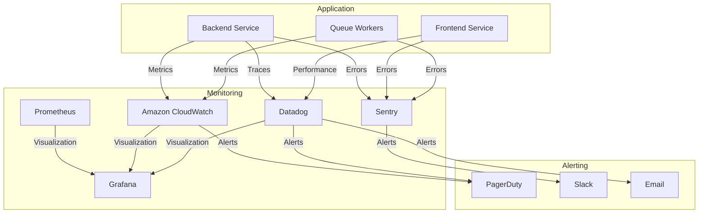
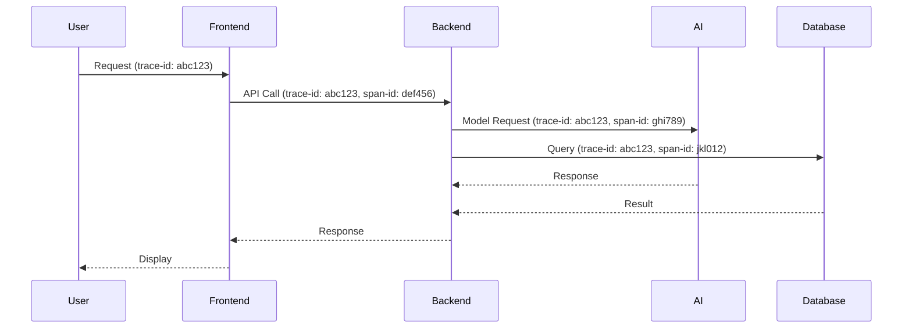

# Monitoring and Observability Guide

## Monitoring Architecture



## Key Monitoring Tools

| Tool | Purpose | Coverage |
|---|---|---|
| **Amazon CloudWatch** | Infrastructure metrics, logs | Full stack |
| **Sentry** | Error tracking, performance | Frontend + Backend |
| **Datadog** | APM, distributed tracing | Backend services |
| **Prometheus** | Custom metrics | Backend + Infrastructure |
| **Grafana** | Dashboards, visualization | All data sources |
| **PagerDuty** | Incident management | All alerts |
| **Statuspage** | Public status page | User-facing |

## Metrics Collection

### Standard Metrics

| Category | Metric | Collection Interval | Retention |
|---|---|---|---|
| **Application** | Request count | 1 minute | 30 days |
| **Application** | Response time | 1 minute | 30 days |
| **Application** | Error rate | 1 minute | 30 days |
| **Database** | Query count | 1 minute | 30 days |
| **Database** | Query time | 1 minute | 30 days |
| **Database** | Connections | 1 minute | 30 days |
| **Cache** | Hit ratio | 1 minute | 30 days |
| **Cache** | Memory usage | 1 minute | 30 days |
| **Queue** | Job count | 1 minute | 30 days |
| **Queue** | Processing time | 1 minute | 30 days |
| **Infrastructure** | CPU usage | 1 minute | 30 days |
| **Infrastructure** | Memory usage | 1 minute | 30 days |
| **Infrastructure** | Network I/O | 1 minute | 30 days |

### Custom Metrics

| Metric | Description | Source | Use Case |
|---|---|---|---|
| `analysis.duration` | Screenplay analysis duration | Backend | Performance monitoring |
| `ai.calls` | AI model API calls | Backend | Cost monitoring |
| `ai.tokens` | AI tokens consumed | Backend | Usage tracking |
| `user.sessions` | Active user sessions | Frontend | Engagement tracking |
| `editor.usage` | Editor tool usage | Frontend | Feature adoption |
| `queue.backlog` | Background job backlog | Workers | Capacity planning |

## Alerting Configuration

### Alert Severity Levels

| Severity | Response Time | Notification Method |
|---|---|---|
| Critical | Immediate | PagerDuty + Slack + Email |
| High | <15 minutes | Slack + Email |
| Medium | <30 minutes | Email |
| Low | <1 hour | Email (daily digest) |

### Alert Examples

**Critical Alert: Service Unavailable**
```yaml
- alert: ServiceUnavailable
  expr: up{job="backend"} == 0
  for: 5m
  labels:
    severity: critical
  annotations:
    summary: "Backend service is down"
    description: "Backend service {{ $labels.instance }} has been down for more than 5 minutes"
```

**High Alert: High Error Rate**
```yaml
- alert: HighErrorRate
  expr: rate(http_requests_total{status=~"5.."}[5m]) / rate(http_requests_total[5m]) > 0.05
  for: 5m
  labels:
    severity: high
  annotations:
    summary: "High error rate detected"
    description: "Error rate is {{ $value }} for service {{ $labels.service }}"
```

**Medium Alert: High CPU Usage**
```yaml
- alert: HighCPUUsage
  expr: 100 - (avg by(instance) (rate(node_cpu_seconds_total{mode="idle"}[1m])) * 100) > 80
  for: 15m
  labels:
    severity: medium
  annotations:
    summary: "High CPU usage"
    description: "CPU usage is {{ $value }}% on {{ $labels.instance }}"
```

## Dashboards

### Standard Dashboards

| Dashboard | Purpose | Access |
|---|---|---|
| **Overview** | High-level system status | All team members |
| **API Performance** | API response times and errors | Backend team |
| **Database** | Database performance metrics | DevOps team |
| **Queue System** | Background job metrics | DevOps team |
| **Frontend** | Frontend performance | Frontend team |
| **AI Services** | AI model usage and costs | AI team |
| **Infrastructure** | Server and container metrics | DevOps team |
| **SLOs** | Service Level Objectives | All team members |

### Dashboard Examples

**API Performance Dashboard**
- Request rate (RPM)
- Response time (P50, P90, P95)
- Error rate by endpoint
- Top slow endpoints
- Status code distribution

**Database Dashboard**
- Query execution time
- Connection pool usage
- Active connections
- Slow queries
- Lock contention

## Logging

### Log Levels

| Level | Usage | Retention |
|---|---|---|
| **ERROR** | Critical failures | 90 days |
| **WARN** | Potential issues | 60 days |
| **INFO** | Normal operations | 30 days |
| **DEBUG** | Development debugging | 7 days |
| **TRACE** | Detailed tracing | Disabled in production |

### Log Format

```json
{
  "timestamp": "2026-05-11T00:33:06Z",
  "level": "INFO",
  "service": "backend",
  "version": "1.0.0",
  "requestId": "req-12345",
  "userId": "user-67890",
  "message": "Screenplay analysis started",
  "context": {
    "analysisId": "anal-11223",
    "screenplayLength": 15248,
    "model": "gemini-2.5-flash"
  },
  "durationMs": 45
}
```

### Log Sources

| Source | Format | Volume | Retention |
|---|---|---|---|
| Backend service | JSON | High | 30 days |
| Frontend service | JSON | Medium | 30 days |
| Database | Text | Low | 7 days |
| Queue workers | JSON | Medium | 30 days |
| Infrastructure | Text | Low | 7 days |

## Tracing

### Distributed Tracing



### Trace Context

```json
{
  "traceId": "abc123def456ghi789",
  "spanId": "def456",
  "parentSpanId": null,
  "serviceName": "backend",
  "operationName": "analyzeScreenplay",
  "startTime": "2026-05-11T00:33:06Z",
  "endTime": "2026-05-11T00:33:08Z",
  "durationMs": 2000,
  "tags": {
    "http.method": "POST",
    "http.path": "/api/analysis/screenplay",
    "http.status_code": 200,
    "user.id": "user-67890",
    "analysis.id": "anal-11223"
  }
}
```

## Health Checks

### Health Check Endpoints

| Endpoint | Purpose | Response |
|---|---|---|
| `/health` | Basic health check | `{"status": "healthy"}` |
| `/health/live` | Liveness probe | HTTP 200 if alive |
| `/health/ready` | Readiness probe | HTTP 200 if ready |
| `/health/detailed` | Comprehensive health | Full system status |
| `/metrics` | Prometheus metrics | Text format metrics |

### Health Check Implementation

```typescript
// Example health check controller
class HealthController {
  async getHealth(req: Request, res: Response) {
    const health = {
      status: 'healthy',
      timestamp: new Date().toISOString(),
      version: process.env.npm_package_version,
      uptime: process.uptime()
    };
    res.json(health);
  }

  async getDetailedHealth(req: Request, res: Response) {
    const [dbHealth, cacheHealth, aiHealth] = await Promise.all([
      checkDatabaseHealth(),
      checkCacheHealth(),
      checkAIHealth()
    ]);

    const health = {
      status: dbHealth && cacheHealth && aiHealth ? 'healthy' : 'degraded',
      components: {
        database: dbHealth ? 'healthy' : 'unhealthy',
        cache: cacheHealth ? 'healthy' : 'unhealthy',
        aiServices: aiHealth ? 'healthy' : 'degraded'
      },
      dependencies: [
        { name: 'PostgreSQL', status: dbHealth ? 'healthy' : 'unhealthy' },
        { name: 'Redis', status: cacheHealth ? 'healthy' : 'unhealthy' },
        { name: 'Gemini API', status: aiHealth ? 'healthy' : 'degraded' }
      ]
    };
    res.json(health);
  }
}
```

## Service Level Objectives (SLOs)

### SLO Definitions

| Service | SLO | Measurement | Target |
|---|---|---|---|
| **Backend API** | Availability | % of successful requests | 99.9% |
| **Backend API** | Latency | P95 response time | <500ms |
| **Backend API** | Error Rate | % of failed requests | <0.1% |
| **Frontend** | Availability | % of successful page loads | 99.5% |
| **Frontend** | Latency | P95 page load time | <2s |
| **Database** | Availability | % uptime | 99.99% |
| **Database** | Latency | P95 query time | <100ms |
| **Queue System** | Processing Time | P95 job processing time | <5min |
| **AI Services** | Availability | % successful AI calls | 99.0% |

### Error Budgets

| Service | SLO | Error Budget (30 days) |
|---|---|---|
| Backend API | 99.9% | 43 minutes |
| Frontend | 99.5% | 3.6 hours |
| Database | 99.99% | 4.3 minutes |
| Queue System | 99.5% | 3.6 hours |

## Incident Detection

### Anomaly Detection

| Pattern | Detection Method | Response |
|---|---|---|
| Sudden traffic spike | Rate change detection | Auto-scale + alert |
| Error rate spike | Statistical threshold | Alert + rollback |
| Response time increase | Moving average | Alert + investigation |
| Database slowdown | Query time increase | Alert + optimization |
| Cache miss increase | Hit ratio drop | Alert + cache warming |

### Incident Detection Tools

| Tool | Detection Method | Response Time |
|---|---|---|
| CloudWatch Alarms | Threshold breaches | <1 minute |
| Sentry | Error rate spikes | <1 minute |
| Datadog Anomaly Detection | ML-based patterns | <2 minutes |
| Prometheus Alertmanager | Rule-based alerts | <1 minute |
| Custom Metrics | Business logic | <5 minutes |

## Capacity Planning

### Capacity Metrics

| Resource | Current Usage | Capacity | Headroom | Growth Rate |
|---|---|---|---|---|
| **ECS Tasks** | 8 | 20 | 12 | 2/month |
| **Database Connections** | 120 | 500 | 380 | 10/month |
| **Redis Memory** | 4GB | 16GB | 12GB | 500MB/month |
| **API Requests** | 2,500 RPM | 10,000 RPM | 7,500 RPM | 200 RPM/month |
| **Bandwidth** | 150Mbps | 1Gbps | 850Mbps | 15Mbps/month |

### Scaling Policies

**Automatic Scaling:**
- CPU > 70% for 3 minutes → Scale out
- CPU < 40% for 10 minutes → Scale in
- Memory > 80% for 3 minutes → Scale out
- Queue length > 50 → Add workers

**Manual Scaling:**
- Planned traffic increases
- Marketing campaigns
- Special events
- Database maintenance

## Reporting

### Standard Reports

| Report | Frequency | Audience | Content |
|---|---|---|---|
| **Daily Operations** | Daily | DevOps Team | Alerts, incidents, metrics |
| **Weekly Performance** | Weekly | Engineering | SLOs, trends, improvements |
| **Monthly SLO** | Monthly | Leadership | SLO compliance, error budgets |
| **Quarterly Review** | Quarterly | All Teams | Major incidents, lessons learned |
| **Annual Capacity** | Annual | Leadership | Capacity planning, growth projections |

### Report Examples

**Daily Operations Report:**
```markdown
# Daily Operations Report - 2026-05-11

## Alerts
- [RESOLVED] High CPU usage on backend-1 (10:15-10:45 AM)
- [ACKNOWLEDGED] Increased error rate on /api/analysis (14:30 PM)

## Incidents
- None

## Metrics
- API Requests: 1,850,000 (↑5% from yesterday)
- Error Rate: 0.2% (↓0.1% from yesterday)
- P95 Response Time: 380ms (↓20ms from yesterday)
- Database Connections: 115 (stable)

## Actions Taken
- Scaled backend from 6 to 8 tasks due to CPU alert
- Investigating analysis endpoint error rate increase
```

## Best Practices

### Monitoring Best Practices

1. **Instrument Everything**: Collect metrics from all components
2. **Standardize Metrics**: Use consistent naming and formats
3. **Set Meaningful Alerts**: Avoid alert fatigue
4. **Document Dashboards**: Explain what each dashboard shows
5. **Review Regularly**: Update monitoring as system evolves
6. **Test Alerts**: Ensure alerts work before they're needed
7. **Monitor Error Budgets**: Track SLO compliance
8. **Correlate Data**: Combine metrics, logs, and traces

### Incident Response Best Practices

1. **Acknowledge Quickly**: Let team know you're investigating
2. **Follow Runbook**: Use documented procedures
3. **Communicate Clearly**: Keep stakeholders informed
4. **Document Everything**: Record all actions and decisions
5. **Learn from Incidents**: Conduct post-incident reviews
6. **Update Documentation**: Improve runbooks after incidents
7. **Practice Regularly**: Conduct game days and simulations

## Tools Configuration

### CloudWatch Configuration

```yaml
# cloudwatch-config.yml
metrics:
  - namespace: TheCopy/Backend
    dimensions:
      - name: Service
        value: backend
    metrics:
      - name: RequestCount
        unit: Count
      - name: ResponseTime
        unit: Milliseconds
      - name: ErrorCount
        unit: Count

logs:
  - log_group: /thecopy/backend
    log_stream: '{instance_id}'
    retention: 30
```

### Sentry Configuration

```javascript
// sentry.config.js
Sentry.init({
  dsn: process.env.SENTRY_DSN,
  environment: process.env.NODE_ENV,
  release: process.env.npm_package_version,
  tracesSampleRate: 0.2,
  profilesSampleRate: 0.1,

  integrations: [
    new Sentry.Integrations.Http({ tracing: true }),
    new Sentry.Integrations.Express({ app }),
    new Sentry.Integrations.Postgres(),
    new Sentry.Integrations.Redis()
  ],

  beforeSend(event) {
    // Filter sensitive data
    if (event.request?.data?.password) {
      event.request.data.password = '[filtered]';
    }
    return event;
  }
});
```

## Contact Information

### Monitoring Contacts

| Role | Name | Email | Phone |
|---|---|---|---|
| Monitoring Lead | Alex Johnson | alex@thecopyplatform.com | +1-555-111-2222 |
| CloudWatch Expert | Maria Garcia | maria@thecopyplatform.com | +1-555-222-3333 |
| Sentry Expert | David Kim | david@thecopyplatform.com | +1-555-333-4444 |
| Datadog Expert | Sarah Wilson | sarah@thecopyplatform.com | +1-555-444-5555 |

### Escalation Path

1. **Monitoring Alerts**: First response within 5 minutes
2. **Incident Declaration**: Escalate to team lead if unresolved in 15 minutes
3. **Major Incident**: Escalate to engineering manager if unresolved in 30 minutes
4. **Critical Incident**: Escalate to CTO if unresolved in 1 hour

_meta:
- last_commit: 611b9381dcc0d2254c094172bcca1c7edf12fa67
- date: 2026-05-11
- reference: docs/operations/MONITORING.md:1-200