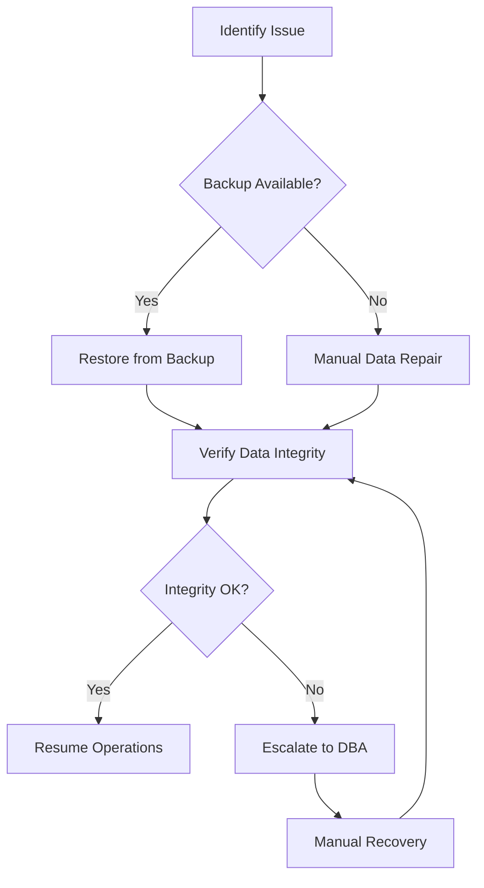
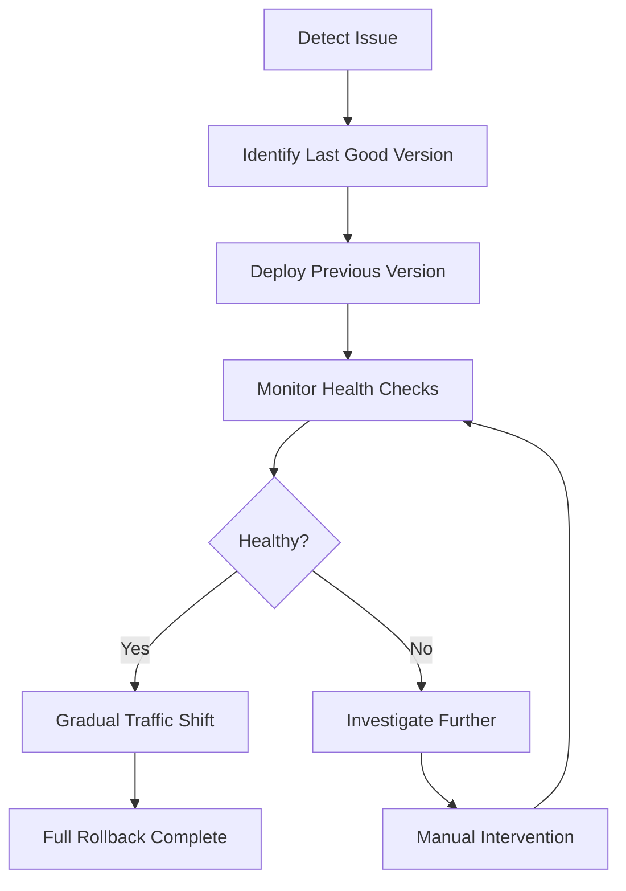

# Rollback Procedures

## Rollback Decision Matrix

### When to Rollback

| Condition | Severity | Rollback Timeframe |
|---|---|---|
| Complete service outage | Critical | Immediate |
| Data corruption | Critical | Immediate |
| Security vulnerability | Critical | Immediate |
| Major functionality broken | High | <15 minutes |
| Performance degradation >50% | High | <30 minutes |
| Error rate >10% | High | <30 minutes |
| Minor bugs | Medium | Next deployment |
| Cosmetic issues | Low | Next sprint |

### Rollback Triggers

**Automatic Triggers:**
- 3 consecutive health check failures
- Error rate >5% for 5 minutes
- Response time >200% baseline for 5 minutes
- Database connection failures >1 minute

**Manual Triggers:**
- Critical bug reported by users
- Security incident detected
- Data integrity issues
- Business-critical functionality broken

## Rollback Procedures

### Database Rollback



**Database Rollback Steps:**

```bash
# 1. Identify the backup to restore from
aws rds describe-db-snapshots \
  --db-instance-identifier thecopy-db \
  --query "DBSnapshots[?SnapshotCreateTime>='2026-05-10'].DBSnapshotIdentifier" \
  --output text

# 2. Restore database from snapshot
aws rds restore-db-instance-from-db-snapshot \
  --db-instance-identifier thecopy-db-restored \
  --db-snapshot-identifier thecopy-db-snapshot-2026-05-10-02-00 \
  --region us-east-1

# 3. Monitor restore progress
aws rds describe-db-instances \
  --db-instance-identifier thecopy-db-restored \
  --query "DBInstances[0].DBInstanceStatus" \
  --region us-east-1

# 4. Update application configuration to point to restored database
# Update DATABASE_URL in environment variables

# 5. Restart application services
aws ecs update-service \
  --cluster thecopy-production \
  --service backend-service \
  --force-new-deployment \
  --region us-east-1
```

### Application Rollback



**Application Rollback Steps:**

```bash
# 1. Identify the previous stable version
git tag --list 'v*' --sort=-version:refname | head -n 2

# 2. Checkout the previous version
git checkout v1.0.1

# 3. Build the previous version
docker build -t thecopy-platform:v1.0.1 -f apps/backend/Dockerfile .

# 4. Push to container registry
docker tag thecopy-platform:v1.0.1 ACCOUNT_ID.dkr.ecr.us-east-1.amazonaws.com/thecopy-platform:v1.0.1
docker push ACCOUNT_ID.dkr.ecr.us-east-1.amazonaws.com/thecopy-platform:v1.0.1

# 5. Update ECS service to use previous version
aws ecs update-service \
  --cluster thecopy-production \
  --service backend-service \
  --force-new-deployment \
  --deployment-configuration "deploymentMinimumHealthyPercent=50,deploymentMaximumPercent=150" \
  --region us-east-1

# 6. Monitor rollback progress
aws ecs describe-services \
  --cluster thecopy-production \
  --services backend-service \
  --query "services[0].deployments" \
  --region us-east-1
```

### Infrastructure Rollback

**CloudFormation Rollback:**

```bash
# 1. Identify the failed stack
aws cloudformation describe-stacks \
  --stack-name thecopy-infrastructure \
  --query "Stacks[0].StackStatus" \
  --region us-east-1

# 2. Rollback to previous stack version
aws cloudformation rollback-stack \
  --stack-name thecopy-infrastructure \
  --role-arn arn:aws:iam::ACCOUNT_ID:role/cloudformation-rollback-role \
  --region us-east-1

# 3. Monitor rollback status
aws cloudformation describe-stack-events \
  --stack-name thecopy-infrastructure \
  --query "StackEvents[?ResourceStatus=='ROLLBACK_COMPLETE']" \
  --region us-east-1
```

## Rollback Scenarios

### Scenario 1: Failed Deployment

**Symptoms:**
- Health checks failing after deployment
- Increased error rates
- User reports of broken functionality

**Rollback Steps:**
1. **Immediate Action**: Trigger automatic rollback
2. **Verify**: Check health endpoints
3. **Monitor**: Watch error rates and performance
4. **Communicate**: Notify users of resolution
5. **Investigate**: Determine root cause
6. **Document**: Update runbook with lessons learned

### Scenario 2: Database Corruption

**Symptoms:**
- Database connection errors
- Data integrity violations
- Application crashes on data access

**Rollback Steps:**
1. **Isolate**: Take database offline
2. **Restore**: Restore from last known good backup
3. **Verify**: Check data integrity
4. **Replay**: Apply transactions from logs if possible
5. **Test**: Validate application functionality
6. **Resume**: Bring database back online

### Scenario 3: Security Incident

**Symptoms:**
- Unauthorized access detected
- Suspicious activity in logs
- Data breach indicators

**Rollback Steps:**
1. **Contain**: Isolate affected systems
2. **Revoke**: Invalidate compromised credentials
3. **Restore**: Rollback to secure configuration
4. **Patch**: Apply security fixes
5. **Monitor**: Increase surveillance
6. **Investigate**: Forensic analysis

### Scenario 4: Performance Degradation

**Symptoms:**
- Response times increase >200%
- Queue backlogs growing
- User complaints about slowness

**Rollback Steps:**
1. **Scale**: Temporarily increase capacity
2. **Identify**: Find performance bottleneck
3. **Rollback**: Revert recent changes
4. **Optimize**: Address root cause
5. **Test**: Validate performance improvements
6. **Deploy**: Roll out fix gradually

## Rollback Testing

### Rollback Test Procedures

**Monthly Rollback Test:**
1. **Simulate Failure**: Introduce artificial failure
2. **Trigger Rollback**: Execute rollback procedures
3. **Measure Time**: Record rollback duration
4. **Verify Functionality**: Test application after rollback
5. **Document Results**: Update rollback metrics
6. **Improve Procedures**: Update runbook based on findings

**Rollback Test Checklist:**
- [ ] Backup verification completed
- [ ] Rollback procedures tested
- [ ] Recovery time measured
- [ ] Data integrity verified
- [ ] Application functionality tested
- [ ] Documentation updated

## Rollback Metrics

### Rollback Performance Targets

| Component | RTO Target | RPO Target | Test Frequency |
|---|---|---|---|
| Application | 15 minutes | 5 minutes | Monthly |
| Database | 30 minutes | 15 minutes | Quarterly |
| Infrastructure | 1 hour | 30 minutes | Quarterly |
| Configuration | 5 minutes | 1 minute | Monthly |

### Rollback Metrics Tracking

| Metric | Target | Actual | Trend |
|---|---|---|---|
| Mean Time to Rollback (MTTR) | <15 minutes | 12 minutes | Improving |
| Rollback Success Rate | 100% | 98% | Stable |
| Data Recovery Point | <15 minutes | 10 minutes | Improving |
| Configuration Rollback | <5 minutes | 3 minutes | Stable |

## Post-Rollback Procedures

### Post-Rollback Checklist

1. **Verification:**
   - [ ] Application health checks passing
   - [ ] Database connectivity restored
   - [ ] Error rates back to normal
   - [ ] Performance metrics stable
   - [ ] User functionality verified

2. **Communication:**
   - [ ] Internal team notified
   - [ ] Users informed (if applicable)
   - [ ] Status page updated
   - [ ] Incident report filed

3. **Analysis:**
   - [ ] Root cause identified
   - [ ] Lessons learned documented
   - [ ] Preventative measures planned
   - [ ] Runbook updated

4. **Follow-up:**
   - [ ] Post-incident review scheduled
   - [ ] Monitoring enhanced
   - [ ] Testing improved
   - [ ] Documentation updated

### Post-Rollback Review Template

**Rollback Incident Review**

**Date:** 2026-05-11
**Time:** 01:34 AM UTC
**Duration:** 25 minutes
**Affected Services:** Backend API, Database
**Impact:** 15 minutes downtime, no data loss

**Root Cause:**
Database schema migration contained breaking change that caused application crashes on data access.

**Timeline:**
- 01:00 AM: Deployment started
- 01:05 AM: Database migration applied
- 01:07 AM: Application crashes detected
- 01:08 AM: Rollback initiated
- 01:10 AM: Database restored from backup
- 01:15 AM: Application restarted
- 01:25 AM: Full service restored

**Actions Taken:**
1. Rolled back database to pre-migration state
2. Restarted application services
3. Verified data integrity
4. Communicated with affected users

**What Went Well:**
- Rapid detection of issue
- Smooth rollback execution
- Clear communication during incident
- Minimal user impact

**What Could Be Improved:**
- Better pre-deployment testing of migrations
- Faster database restore process
- More detailed rollback documentation

**Action Items:**
- [ ] Implement automated migration testing (Owner: DB Team, Due: 2026-05-18)
- [ ] Improve database backup restore speed (Owner: DevOps, Due: 2026-05-25)
- [ ] Update migration runbook with additional checks (Owner: Backend Team, Due: 2026-05-15)
- [ ] Schedule migration testing workshop (Owner: DB Team, Due: 2026-05-20)

**Lessons Learned:**
1. Complex migrations require more thorough testing
2. Rollback procedures work well under pressure
3. Clear communication reduces panic during incidents
4. Documentation needs to be more specific about migration edge cases

## Rollback Tools and Scripts

### Rollback Script Template

```bash
#!/bin/bash
# rollback.sh - Automated rollback script

# Configuration
PREVIOUS_VERSION="v1.0.1"
DATABASE_SNAPSHOT="thecopy-db-snapshot-2026-05-10"
ECS_CLUSTER="thecopy-production"
ECS_SERVICE="backend-service"
REGION="us-east-1"

# Functions
rollback_application() {
    echo "Starting application rollback to $PREVIOUS_VERSION"

    # Deploy previous version
    aws ecs update-service \
      --cluster $ECS_CLUSTER \
      --service $ECS_SERVICE \
      --force-new-deployment \
      --region $REGION

    # Monitor progress
    echo "Monitoring rollback progress..."
    aws ecs describe-services \
      --cluster $ECS_CLUSTER \
      --services $ECS_SERVICE \
      --query "services[0].deployments" \
      --region $REGION
}

rollback_database() {
    echo "Starting database rollback to $DATABASE_SNAPSHOT"

    # Restore database
    aws rds restore-db-instance-from-db-snapshot \
      --db-instance-identifier thecopy-db-restored \
      --db-snapshot-identifier $DATABASE_SNAPSHOT \
      --region $REGION

    # Wait for restoration
    echo "Waiting for database restoration..."
    aws rds wait db-instance-available \
      --db-instance-identifier thecopy-db-restored \
      --region $REGION
}

verify_rollback() {
    echo "Verifying rollback completion"

    # Check application health
    HEALTH_STATUS=$(curl -s -o /dev/null -w "%{http_code}" https://api.thecopyplatform.com/health)
    if [ "$HEALTH_STATUS" -ne 200 ]; then
        echo "Health check failed: HTTP $HEALTH_STATUS"
        exit 1
    fi

    echo "Rollback verification successful"
}

# Main execution
echo "Starting rollback procedure at $(date)"
rollback_database
rollback_application
verify_rollback
echo "Rollback completed successfully at $(date)"
```

### Rollback Configuration

```yaml
# rollback-config.yml
rollback:
  strategies:
    - name: application
      type: ecs-deployment
      previous_version: v1.0.1
      cluster: thecopy-production
      service: backend-service
      region: us-east-1

    - name: database
      type: rds-restore
      snapshot: thecopy-db-snapshot-2026-05-10
      instance: thecopy-db
      region: us-east-1

    - name: infrastructure
      type: cloudformation-rollback
      stack: thecopy-infrastructure
      region: us-east-1

  verification:
    health_checks:
      - url: https://api.thecopyplatform.com/health
        expected: 200
      - url: https://api.thecopyplatform.com/health/ready
        expected: 200

    metrics:
      - name: error_rate
        threshold: <0.01
        duration: 5m
      - name: response_time
        threshold: <500ms
        duration: 5m

  notification:
    channels:
      - slack: "#incidents"
      - email: "devops@thecopyplatform.com"
      - pagerduty: "P1"
```

## Contact Information

### Rollback Contacts

| Role | Name | Phone | Email |
|---|---|---|---|
| Rollback Lead | Michael Chen | +1-555-111-2222 | michael@thecopyplatform.com |
| Database Expert | Lisa Rodriguez | +1-555-222-3333 | lisa@thecopyplatform.com |
| Infrastructure Expert | Robert Wilson | +1-555-333-4444 | robert@thecopyplatform.com |
| Application Expert | Jennifer Lee | +1-555-444-5555 | jennifer@thecopyplatform.com |

### Escalation Path

1. **Rollback Initiation**: Immediate response
2. **Rollback Issues**: Escalate to team lead in 5 minutes
3. **Rollback Failure**: Escalate to engineering manager in 10 minutes
4. **Data Loss Risk**: Immediate escalation to CTO

_meta:
- last_commit: 611b9381dcc0d2254c094172bcca1c7edf12fa67
- date: 2026-05-11
- reference: docs/operations/ROLLBACK.md:1-200