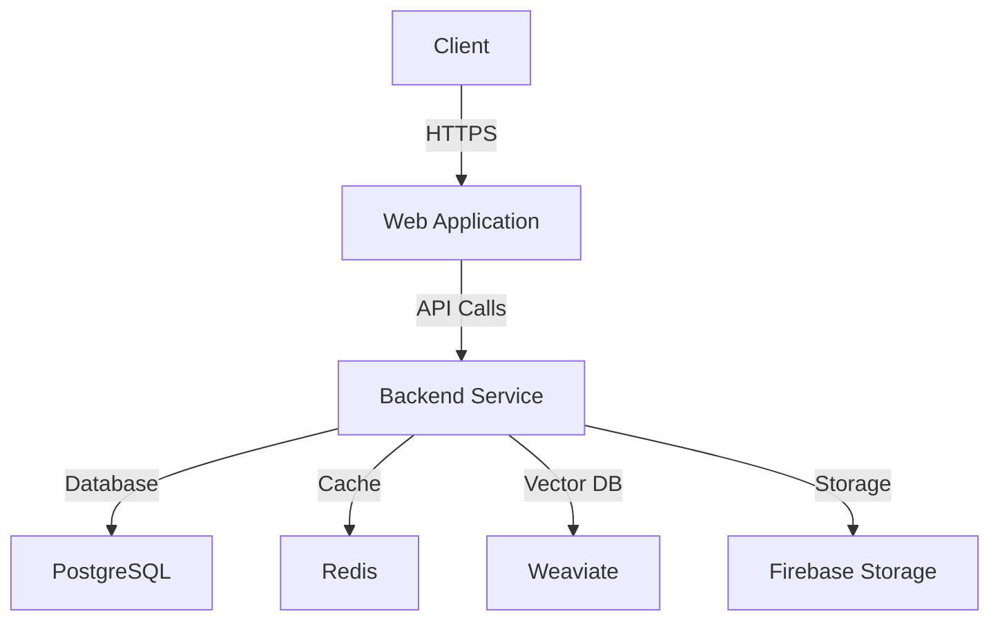

# Threat Model — The Copy Platform

## Overview

This document describes the threat model for The Copy Platform, identifying potential security threats and the mitigations in place.

## System Components

## Threat Analysis

### 1. Authentication Threats

| Threat | Risk Level | Mitigation |
|--------|------------|-----------|
| Credential Stuffing | High | Rate limiting, account lockout |
| Brute Force Attacks | High | Strong password policy, CAPTCHA |
| Session Hijacking | Medium | JWT with short expiration, HttpOnly cookies |
| Token Theft | Medium | Token encryption, secure storage |

### 2. Data Protection Threats

| Threat | Risk Level | Mitigation |
|--------|------------|-----------|
| Data Breach | Critical | Encryption at rest and in transit |
| SQL Injection | High | Parameterized queries, ORM |
| XSS Attacks | High | CSP headers, input sanitization |
| CSRF Attacks | Medium | CSRF tokens, SameSite cookies |

### 3. API Security Threats

| Threat | Risk Level | Mitigation |
|--------|------------|-----------|
| API Abuse | High | Rate limiting, request throttling |
| Insecure Direct Object Reference | High | Authorization checks, indirect references |
| Mass Assignment | Medium | Explicit field whitelisting |
| Information Disclosure | Medium | Proper error handling, minimal responses |

### 4. Infrastructure Threats

| Threat | Risk Level | Mitigation |
|--------|------------|-----------|
| DDoS Attacks | Critical | Cloudflare protection, auto-scaling |
| Server Compromise | Critical | Regular patching, least privilege |
| Container Escape | High | Container hardening, seccomp |
| Secret Leakage | High | Secret management, rotation |

## Attack Surface Analysis

### Web Application

- **Entry Points**: Login page, API endpoints, file uploads
- **Vulnerabilities**: XSS, CSRF, injection attacks
- **Mitigations**: CSP, CSRF tokens, input validation

### Backend Service

- **Entry Points**: REST API, WebSocket connections
- **Vulnerabilities**: Injection, broken authentication
- **Mitigations**: JWT validation, rate limiting

### Database

- **Entry Points**: Connection strings, queries
- **Vulnerabilities**: SQL injection, data exfiltration
- **Mitigations**: ORM, encryption, network isolation

## Security Controls

### Preventive Controls

- Input validation and sanitization
- Authentication and authorization
- Encryption (TLS 1.2+, AES-256)
- Rate limiting and throttling
- Security headers (CSP, HSTS)

### Detective Controls

- Logging and monitoring
- Intrusion detection systems
- Anomaly detection
- Regular security audits
- Vulnerability scanning

### Corrective Controls

- Incident response plan
- Backup and recovery procedures
- Patch management
- Security updates
- User notification system

## Compliance Requirements

### GDPR Compliance

- Data minimization
- User consent management
- Right to be forgotten
- Data breach notification
- Privacy by design

### Industry Standards

- OWASP Top 10 mitigation
- CIS Benchmarks
- NIST guidelines
- ISO 27001 controls

## Risk Assessment

| Component | Risk Level | Mitigation Effectiveness |
|-----------|------------|--------------------------|
| Authentication | High | Effective |
| Data Storage | Critical | Effective |
| API Endpoints | High | Effective |
| Network | Medium | Effective |
| Third-party Services | Medium | Moderate |

## Incident Response

### Detection

- Automated alerts from monitoring systems
- User reports via security@thecopy.ai
- Regular security audits

### Response

1. **Containment**: Isolate affected systems
2. **Eradication**: Remove malicious code/access
3. **Recovery**: Restore from clean backups
4. **Notification**: Inform affected users
5. **Post-mortem**: Analyze and improve

### Communication

- Internal: Security team, management
- External: Affected users, regulators
- Public: Security advisories, blog posts

## Continuous Improvement

- Regular threat modeling sessions
- Security training for developers
- Bug bounty program
- Security champion program
- Red team exercises